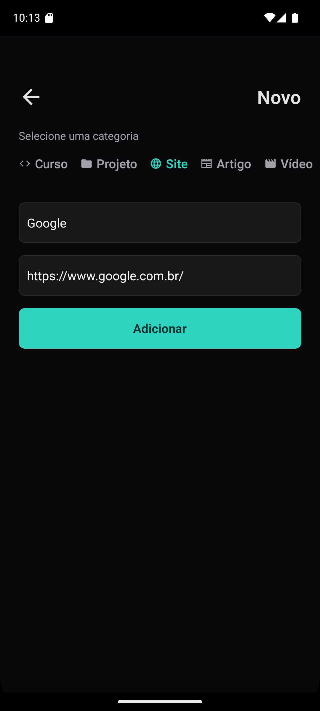
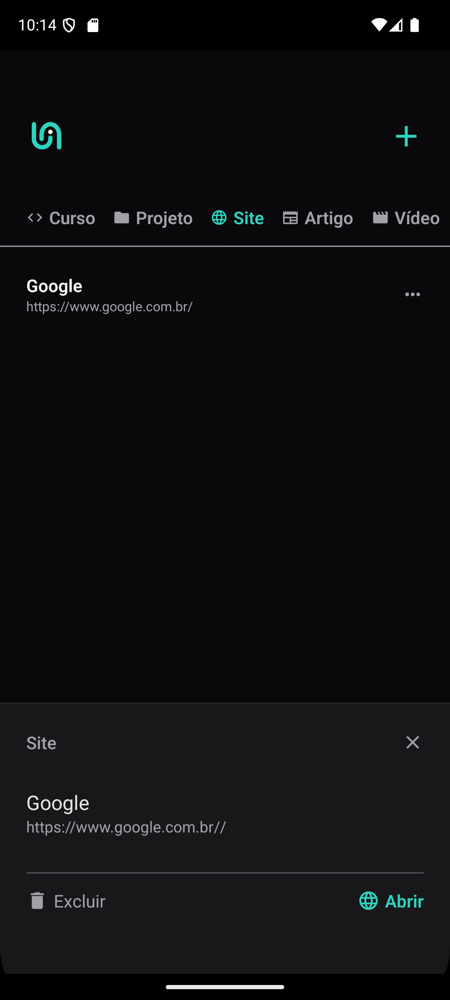

<h1 align="center"> LINKS </h1>

<br>

<div align="center">
  
  
</div>

## Projeto

Este aplicativo permite ao usuário adicionar links, selecionar categorias personalizadas e salvar essas informações diretamente no dispositivo local. Além disso, é possível remover links facilmente, mantendo o gerenciamento simples e eficiente. Com a persistência local, os dados ficam disponíveis mesmo após o fechamento do aplicativo, garantindo acesso contínuo aos links organizados.

## Tecnologias

- React Native
- React
- Typescript
- Expo
- StyleSheet
- Async Storage
- Expo Router

## Executando o projeto

Siga os passos abaixo para configurar e executar o aplicativo em seu ambiente local:

### 1. Clone o repositório

No terminal, execute:

```cl
git clone https://github.com/seu-usuario/seu-repositorio.git
cd seu-repositorio
```

### 2. Instale as dependências

Execute o seguinte comando para instalar as bibliotecas necessárias:

```cl
npm install
```

### 3. Execute o aplicativo

Inicie o servidor de desenvolvimento com:

```cl
expo start
```
